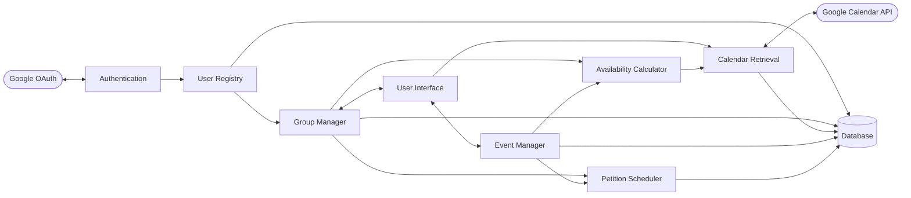
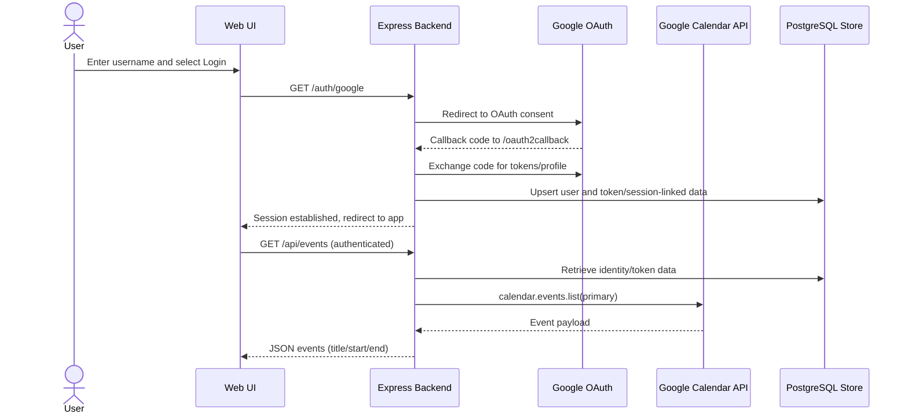
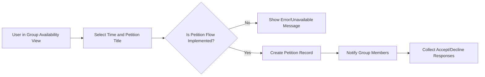
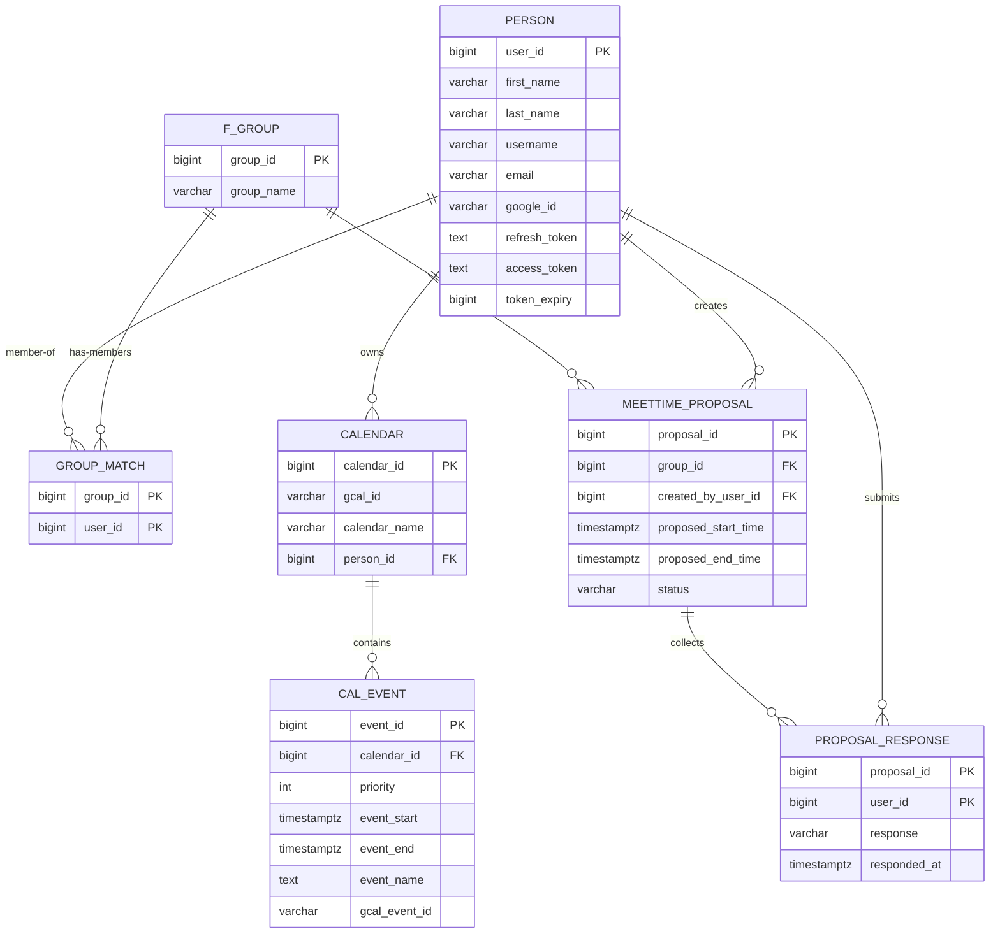

Social Scheduler  
Stella Greenvoss, David Haddad, Anna Norris, Garrett Caldwell  
Software Design Specification

## 1. System Overview
Authors: Stella Greenvoss, David Haddad, Anna Norris, Garrett Caldwell  
Date: February 12, 2026

Social Scheduler is a web-based scheduling system for informal groups (friends/classmates) that coordinates meeting times while minimizing direct sharing of personal calendar details. The current implemented scope focuses on Google OAuth authentication, authenticated Google Calendar retrieval, and non-priority availability computation logic. The MVP target extends this to persistent groups and server-side group availability aggregation. Future scope includes petition workflows, invitation management, and automated time selection.

Status alignment to SRS:
- Implemented: `GET /auth/google`, `GET /oauth2callback`, `GET /api/events`, and personal calendar event processing for availability logic input.
- MVP Target (Gap): persistent group management, server-side group availability endpoint, persistent user profile treatment, and priority-aware availability.
- Future: meet-time petition acceptance/rejection workflows, invitation lifecycle management, and automatic time suggestion.

## 2. Software Architecture
Authors: Stella Greenvoss, David Haddad, Anna Norris, Garrett Caldwell  
Date: February 12, 2026

The architecture is decomposed into function-specific components that separate authentication, calendar access, availability logic, coordination logic, and persistence. This decomposition supports incremental delivery from Implemented features to MVP Target and Future features without tightly coupling all behaviors into a single module.

### 2.1 Software Architecture
Authors: Stella Greenvoss, David Haddad, Anna Norris, Garrett Caldwell  
Date: February 12, 2026

Component set and functionality:
- Authentication (Implemented): runs OAuth redirect/callback flow with Google OAuth and establishes authenticated sessions.
- User Registry (Implemented baseline, MVP expansion): associates authenticated identity with application user records used by downstream modules.
- Calendar Retrieval (Implemented): retrieves authenticated user calendar events from Google Calendar API.
- Availability Calculator (Implemented personal scope): computes availability blocks from event intervals.
- Group Manager (MVP Target): stores groups/memberships and orchestrates group-level availability requests.
- Petition Scheduler (Future): manages proposed meet-time petitions and response tracking workflows.
- Event Manager (Future): supports edit/remove/manual block workflows and petition-linked event lifecycle.
- User Interface (Implemented baseline, MVP expansion): login and calendar rendering now; group and petition workflows as MVP/Future.
- Database (Implemented baseline, MVP/Future expansion): persistence for users/session-linked data and target persistence for groups/proposals.
- External services: Google OAuth and Google Calendar API.

Figure 1. Static architecture model of Social Scheduler components and major dependencies.

What Figure 1 shows:
- The core structural modules in the provided architecture screenshot: Authentication, User Registry, Group Manager, User Interface, Event Manager, Petition Scheduler, Availability Calculator, Calendar Retrieval, and Database.
- Integration boundaries with Google OAuth and Google Calendar API.
- Current and planned collaboration paths among scheduling modules (group coordination, calendar retrieval, availability computation).
- A component-oriented static design, not a runtime message sequence.

Architecture rationale:
- Separating calendar retrieval from availability computation keeps external API concerns out of core scheduling logic.
- Keeping Group Manager and Petition Scheduler distinct supports incremental MVP and Future delivery.
- Centralized persistence enables durable group/petition state while still supporting transient event retrieval behavior required by SRS.

### 2.2 Naming Conventions
Authors: Stella Greenvoss, David Haddad, Anna Norris, Garrett Caldwell  
Date: February 12, 2026

This SDS uses project-specific component names that reflect responsibilities:
- `Authentication` (not “backend auth layer”)
- `Calendar Retrieval` (not “API module”)
- `Availability Calculator` (not “algorithm service”)
- `Group Manager` (not “groups backend”)
- `Petition Scheduler` (not “proposal module”)
- `User Registry` (not “user table logic”)

Naming rules applied:
- Prefer functional nouns/phrases tied to system behavior.
- Avoid generic names such as “frontend”, “backend”, “database module”, “client”, or “server” as component identities.
- Keep names consistent across architecture, module descriptions, and figures.

## 3. Software Modules
Authors: Stella Greenvoss, David Haddad, Anna Norris, Garrett Caldwell  
Date: February 12, 2026

Module subsections:
- M1: Authentication
- M2: User Registry
- M3: Calendar Retrieval
- M4: Availability Calculator
- M5: Group Manager
- M6: Petition Scheduler
- M7: Event Manager
- M8: User Interface
- M9: Database Gateway

### 3.1 Module Role and Primary Function
Authors: Stella Greenvoss, David Haddad, Anna Norris, Garrett Caldwell  
Date: February 12, 2026

1. Authentication (Implemented)
1.1 Role: manages Google OAuth redirect/callback and authenticated session establishment.  
1.2 Primary function: enable protected API access after successful OAuth.

2. User Registry (Implemented baseline; MVP expansion)
2.1 Role: provides app-level user identity records linked to OAuth identities.  
2.2 Primary function: support authenticated lookups and future persistent user-profile requirements.

3. Calendar Retrieval (Implemented)
3.1 Role: fetch user calendar events from Google Calendar API for authenticated sessions.  
3.2 Primary function: return parsed event data for UI rendering and availability input.

4. Availability Calculator (Implemented for personal events)
4.1 Role: compute availability blocks from event windows.  
4.2 Primary function: supply computed intervals/counts used by scheduling views.

5. Group Manager (MVP Target)
5.1 Role: persist and validate group membership and coordinate group availability requests.  
5.2 Primary function: orchestrate member-scoped availability aggregation.

6. Petition Scheduler (Future)
6.1 Role: create and track meet-time petitions and status transitions.  
6.2 Primary function: maintain proposal lifecycle and participant response state.

7. Event Manager (Future)
7.1 Role: support manual block and event adjustment workflows.  
7.2 Primary function: apply user-initiated event edits/removals where supported.

8. User Interface (Implemented baseline; MVP/Future expansion)
8.1 Role: present login, calendar, group, and petition interactions.  
8.2 Primary function: collect user actions and render results from backend services.

9. Database Gateway (Implemented baseline; MVP/Future expansion)
9.1 Role: persistence access for user, group, calendar, and proposal entities.  
9.2 Primary function: enforce consistent CRUD access patterns for data-backed modules.

### 3.2 Interface Specification
Authors: Stella Greenvoss, David Haddad, Anna Norris, Garrett Caldwell  
Date: February 12, 2026

Implemented external interfaces from SRS:
- IF-01 User Authentication Interface (Implemented). Routes: `GET /auth/google`, `GET /oauth2callback`. Auth mechanism: Google OAuth redirect flow; successful callback creates authenticated session.
- IF-02 Calendar Retrieval Interface (Implemented). Route: `GET /api/events`. Auth mechanism: requires authenticated session; unauthenticated requests return HTTP 401.
- IF-03 Personal Calendar Display Interface (Implemented). Input: event JSON from `GET /api/events`. Output: rendered personal calendar UI.

MVP Target interfaces from SRS:
- IF-04 Group Management Interface (MVP Target). Intended behavior: persistent group creation and membership management. SRS status: gap; no fully verified MVP interface behavior yet.
- IF-05 Group Availability Retrieval (MVP Target). Normative target endpoint: `GET /api/groups/{groupId}/availability`. Input parameters: `windowStartMs`, `windowEndMs`, optional `granularityMinutes`. Output: interval list with availability counts. Authorization: requester must be authenticated and group member.

Future interfaces from SRS:
- IF-06 Meet-Time Petition Interface (Future)
- IF-07 Manual Time Block Interface (Future)
- IF-08 Priority Rule Interface (Future)

Interface constraints:
- Session-based authentication boundaries are enforced for implemented protected routes.
- Group availability must be computed server-side (SRS IF-05 requirement).
- No rate-limiting/versioning contract is currently specified in SRS; these are deferred design controls.

### 3.3 Static and Dynamic Models
Authors: Stella Greenvoss, David Haddad, Anna Norris, Garrett Caldwell  
Date: February 12, 2026

Static model reference:
- Figure 1 is the architecture-level static model.

Figure 2. Dynamic sequence model for implemented OAuth login and personal calendar event retrieval.

What Figure 2 shows:
- Runtime actor/message ordering across user, UI, backend, Google OAuth, calendar provider, and persistence.
- Session creation path before protected calendar retrieval.
- Dependency of `GET /api/events` on authenticated identity and provider token context.
- Implemented behavior boundary: this sequence excludes MVP Target group aggregation and Future petition workflows.

Figure 3. Petition workflow/error behavior model aligned to the provided petition error UI screenshot.

### 3.4 Design Rationale
Authors: Stella Greenvoss, David Haddad, Anna Norris, Garrett Caldwell  
Date: February 12, 2026

Module-level rationale:
- Authentication is isolated to contain external identity coupling and session security concerns.
- Calendar Retrieval is isolated to constrain provider-specific logic and keep computation modules provider-agnostic.
- Availability Calculator is separated for deterministic, testable behavior independent of persistence and transport.
- Group Manager is an explicit coordination boundary for authorization and aggregation semantics required by MVP.
- Petition Scheduler and Event Manager remain separate Future modules to prevent premature coupling of proposal and event mutation workflows.
- User Interface remains thin relative to backend rules so authorization and aggregation logic stays server-side.
- Database responsibilities are centralized to preserve data integrity and normalize group/user/event/proposal relationships.

## 4. Alternative Designs
Authors: Stella Greenvoss, David Haddad, Anna Norris, Garrett Caldwell  
Date: February 12, 2026

Alternative A: Fully client-side aggregation
- Idea: fetch all participant events to each client and compute group availability in browser.
- Rejected because it increases privacy risk and weakens membership authorization controls.
- Current design keeps aggregation server-side (MVP target) and exposes aggregated outputs.

Alternative B: Monolithic scheduling module
- Idea: place authentication, retrieval, availability, and group logic in one service/module.
- Rejected because this reduces maintainability and testability, and makes MVP/Future separation unclear.
- Current decomposition supports incremental implementation by status tier.

Alternative C: Manual-only scheduling input (no calendar integration)
- Idea: users manually enter all availability blocks (When2Meet-like approach).
- Rejected because SRS motivation explicitly targets reduced repeated manual entry.
- Google Calendar retrieval remains the baseline implemented path.

## 5. Database Design
Authors: Stella Greenvoss, David Haddad, Anna Norris, Garrett Caldwell  
Date: February 12, 2026

The persistence design follows normalized relational modeling (3NF intent) and separates users, groups, memberships, calendars/events, and proposal-response records. Implemented baseline persistence is centered on user/session-linked identity. Per SRS external behavior, calendar data is treated as transient; calendar/event persistence structures are internal support and not a required user-visible contract. Group and petition persistence remains MVP Target/Future per SRS status labels.

Figure 4. Static ER model derived from the provided ER figure and SRS scope/status definitions.

What Figure 4 shows:
- Normalized core entities and key relationships for user/group/event data.
- Many-to-many group membership resolved through a junction relation (`GROUP_MATCH`).
- Calendar/event structures and priority field placement, while SRS still treats calendar retrieval as transient user-visible behavior.
- Proposal/response entities are included as Future-scope extensions (status-labeled, not claimed implemented).

3NF rationale summary:
- Distinct entities (person, group, calendar, event, proposal, response) are modeled separately.
- Non-key attributes depend on their relation’s key, avoiding repeated multivalued data in single rows.
- Many-to-many membership and response tracking use composite-key junction relations.

## 6. References
Authors: Stella Greenvoss, David Haddad, Anna Norris, Garrett Caldwell  
Date: February 12, 2026

- SRS_Submittable.docx, Social Scheduler Software Requirements Specification, February 2026.
- SDS_Template.docx, course-provided Software Design Specification template.
- IEEE Std 1016-2009. IEEE Standard for Information Technology—Systems Design—Software Design Descriptions.
- Parnas, D. L. (1972). On the criteria to be used in decomposing systems into modules. Communications of the ACM, 15(12), 1053-1058.
- Class Diagram. Wikipedia. https://en.wikipedia.org/wiki/Class_diagram
- Sequence Diagram. Wikipedia. https://en.wikipedia.org/wiki/Sequence_diagram
- Database normalization. Wikipedia. https://en.wikipedia.org/wiki/Database_normalization

## 7. Acknowledgments
Authors: Stella Greenvoss, David Haddad, Anna Norris, Garrett Caldwell  
Date: February 12, 2026

- Course staff feedback and project milestone guidance.
- Project team review/approval of scope labels and design decisions.
- AI-assisted drafting support used for formatting and consistency checks; all final technical scope/status decisions were validated by the project team.
